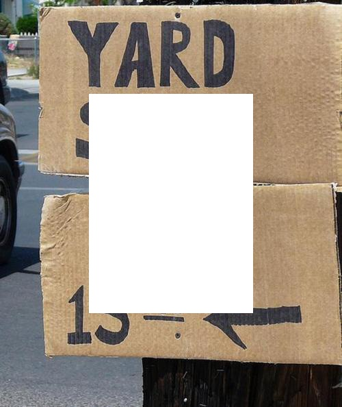
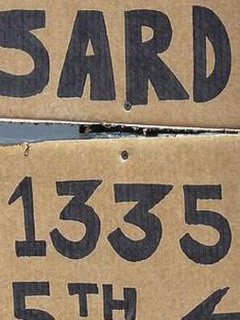
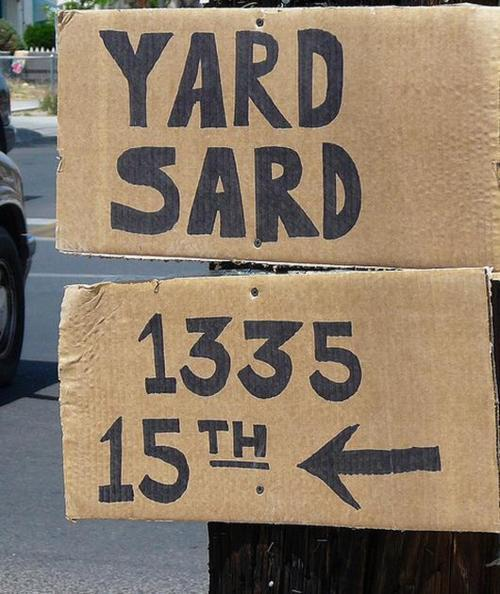
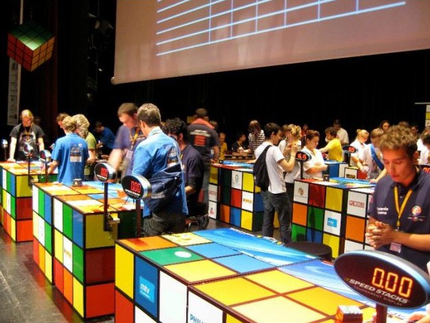
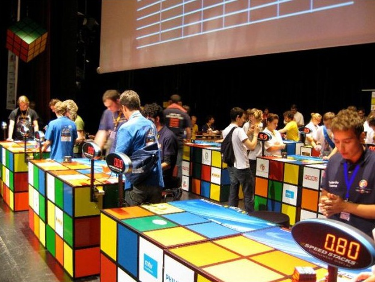
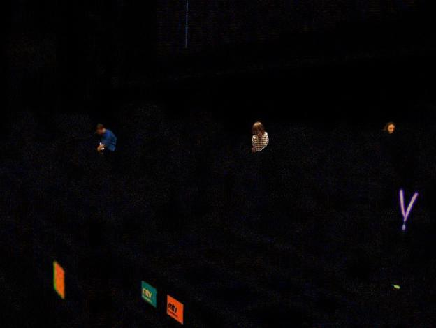
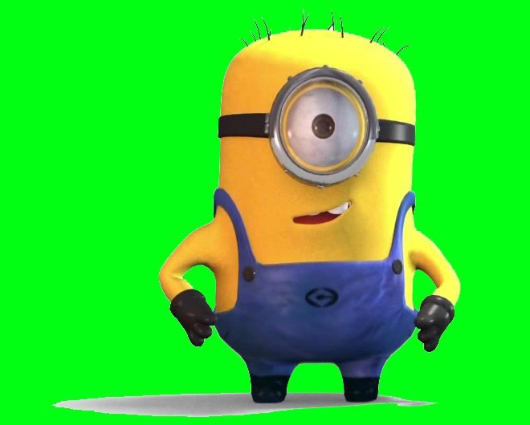

<!-- sections:

    1. Title
    2. Introduction
    3. Implementation
    4. Usage

 -->

 <!-- PROJECT TITLE -->

# Image Processing Tasks

<!-- TABLE OF CONTENTS -->

  
Table of Contents

  <ol>
    <li><a href="#introduction">Introduction</a></li>
    <li><a href="#implementation-overview">Implementation Overview</a></li>
    <li><a href="#usage">Usage</a></li>
  </ol>

<!-- Introduction -->

## Introduction

Wrote 3 scripts using NumPy array manipulation to process images.

<!-- Implementation Overview  -->

## Implementation Overview

### Script 1 to join images

Reads in 2 images and utilizes array slicing to put the images back together.

### Script 2 to identify differences between 2 images

Reads in 2 images and makes copies of them. It then processes the images by converting the data types to float to avoid integer overflow. Finally, gets the difference between the images and convert all floats in numPy array to positive numbers.

### Script 3 to place an image on a new background

Uses masking to extract specific parts of an image and apply to another image.

<!-- USAGE EXAMPLES -->

## Usage

### Script 1 Input

### Script 1 Output

### Script 2 Input

### Script 2 Output

### Script 3 Input

### Script 3 Output

